# Démarrage rapide — tdb

**tdb** est inspiré de [Grist](https://www.getgrist.com) — pour tout usage sérieux ou en
production, l'utilisateur est invité à se tourner vers ce dernier en priorité.

**tdb** est une interface graphique pour [Tarantool](https://www.tarantool.io/) permettant
de créer et gérer des espaces de données (tables), de les relier entre eux, d'y définir des
colonnes calculées ou des triggers, et de composer des vues personnalisées déclaratives (YAML).

---

## Prérequis

- [Docker](https://www.docker.com/) (ou Tarantool 3.x installé localement)
- `make`, `moonc` (compilateur MoonScript), `coffee` (CoffeeScript) — uniquement pour
  modifier les sources

---

## Lancement

```bash
git clone <repo>
cd tdb
docker compose up
```

L'interface est disponible sur **http://localhost:8080**.

---

## Connexion

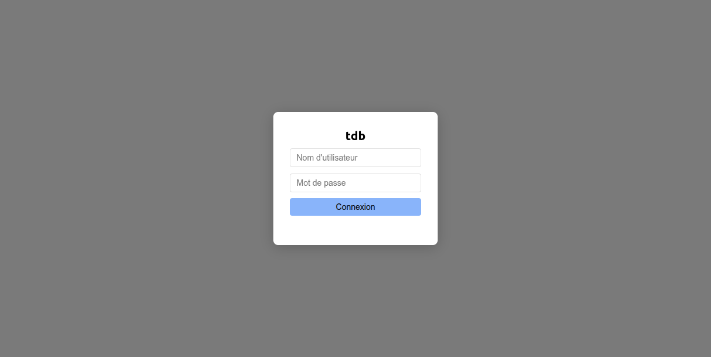

Au premier démarrage, un compte **admin** est créé automatiquement avec le mot de passe
**admin**.

> [!] Un bandeau d'avertissement s'affiche tant que ce mot de passe par défaut n'a pas été
> changé. Cliquez sur « Changer maintenant » ou passez par le menu profil (en bas à gauche).

---

## Présentation de l'interface

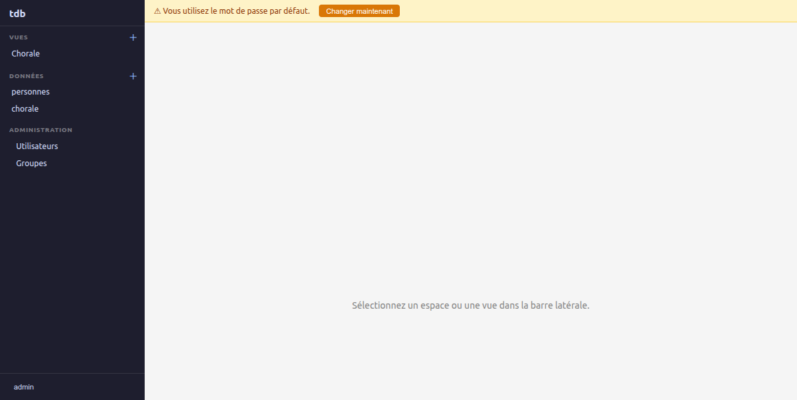

L'interface est divisée en deux zones :

| Zone | Rôle |
|------|------|
| **Barre latérale** (gauche) | Navigation entre Vues, Données et Administration |
| **Contenu** (droite) | Grille de données, éditeur de vue ou panel d'administration |

---

## Créer un espace (table)

1. Dans la section **Données** de la barre latérale, cliquez sur **+**.
2. Saisissez le nom de l'espace (ex. `produits`) et validez.
3. L'espace apparaît dans la liste ; cliquez dessus pour l'ouvrir.

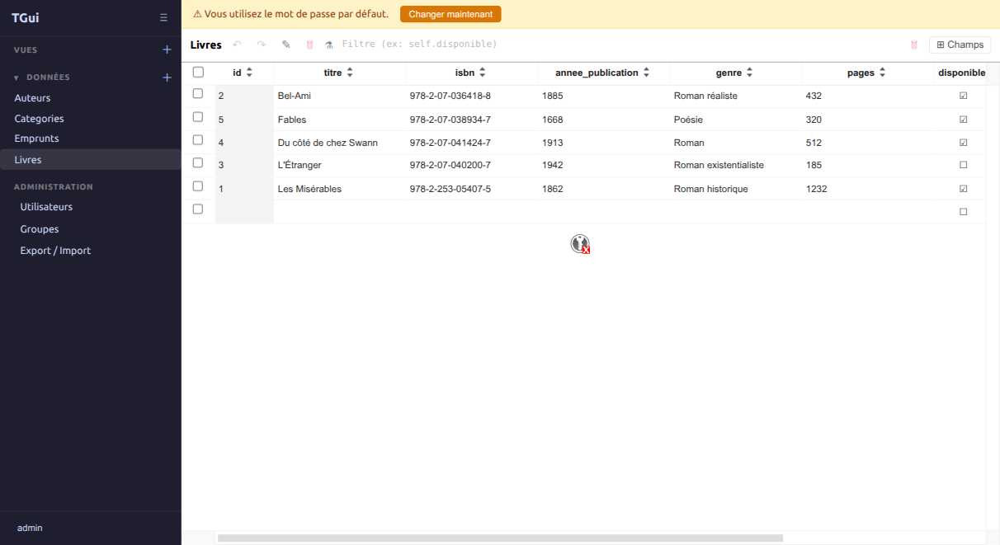

---

## Ajouter et gérer des champs

Cliquez sur **[#] Champs** dans la barre d'outils pour ouvrir le panel latéral.

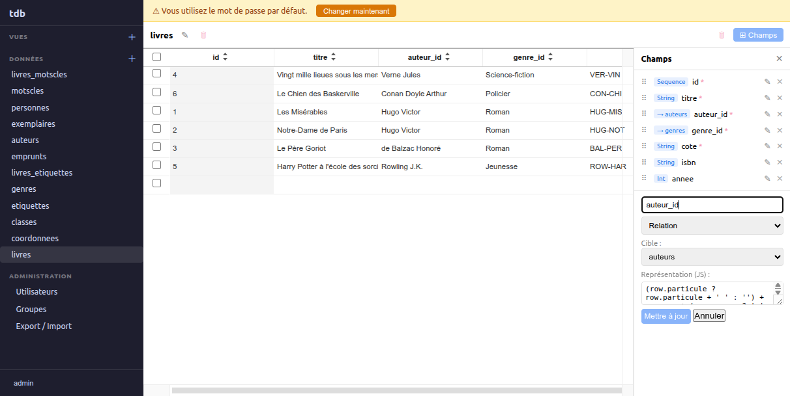

### Créer un champ simple

1. Saisissez le **nom** du champ.
2. Choisissez le **type** : `String`, `Int`, `Float`, `Boolean`, `UUID`, `Séquence`, `Any`,
   `Map`, `Array`, ou `Relation`.
3. Cochez **Requis** si la valeur ne peut pas être nulle.
4. Cliquez sur **Ajouter**.

### Colonne calculée (λ)

Sélectionnez **Colonne calculée** et saisissez une expression MoonScript ou Lua.
La formule est le corps d'une fonction `(self, space) -> <formule>` ; en MoonScript,
`@champ` accède à `self.champ` :

```moonscript
-- Exemple : concaténer prénom et nom
"#{@prenom} #{@nom}"
```

La valeur est recalculée à chaque lecture ; elle n'est pas stockée.

### Trigger formula ((trigger))

Sélectionnez **Trigger formula** et, optionnellement, listez les champs déclencheurs.
La formule est exécutée et le résultat **stocké** lors de chaque création ou modification
des champs listés.

```moonscript
-- Exemple : générer un slug à partir du titre
@titre\lower!\gsub ' ', '-'
```

### Modifier un champ existant

Cliquez sur **(crayon)** à côté du champ pour éditer son nom, type, formule ou trigger.

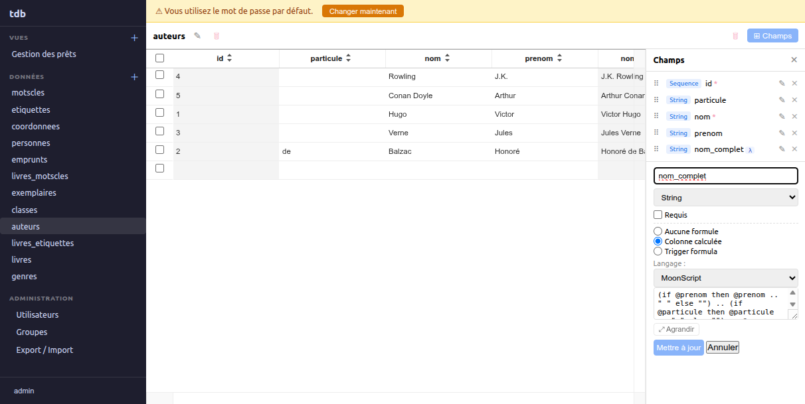

---

## Saisir et éditer des données

- Cliquez sur une cellule pour l'éditer directement dans la grille.
- Appuyez sur **Entrée** ou tabulation pour passer à la suivante.
- Pour **ajouter une ligne**, cliquez dans la zone vide sous la dernière ligne.
- Pour **supprimer des lignes**, sélectionnez-les (cases à cocher) puis cliquez sur le
  bouton [suppr] « Supprimer les lignes sélectionnées ».

---

## Relations entre espaces

Dans le panel **Champs**, choisissez le type **Relation** :

1. Choisissez l'espace **cible** dans la liste déroulante (y compris l'espace lui-même,
   pour des relations récursives, ex. généalogiques).
2. Le champ stockera l'identifiant de l'enregistrement lié.

Les relations permettent ensuite de construire des vues personnalisées avec filtrage
automatique (dépendances inter-widgets).

---

## Vues personnalisées (YAML)

Les vues permettent de composer des tableaux de bord multi-espaces.

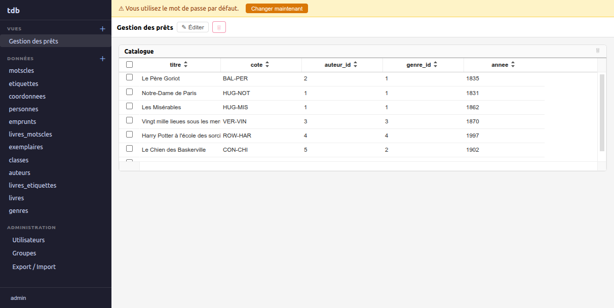

### Créer une vue

1. Dans la section **Vues**, cliquez sur **+**.
2. Donnez un nom à la vue.
3. L'éditeur YAML s'ouvre automatiquement.

### Syntaxe YAML

```yaml
layout:
  direction: vertical          # vertical | horizontal
  children:
    - widget:
        id: mon_widget
        title: Mes produits
        space: produits         # nom de l'espace
        columns: [nom, prix]    # colonnes affichées (optionnel, toutes par défaut)
    - layout:
        direction: horizontal
        children:
          - widget:
              id: detail
              title: Détail commande
              space: commandes
              depends_on:
                widget: mon_widget  # filtrage sur la sélection du widget parent
                field: id_produit   # champ de jointure dans cet espace
                from_field: id      # champ source dans le widget parent (défaut : id)
              factor: 2             # poids relatif (défaut : 1)
          - widget:
              id: stats
              title: Statistiques
              space: stats
              factor: 1
```

### Éditeur YAML avec schéma ERD

Cliquer sur **« Éditer »** ouvre un modal plein écran avec deux panneaux :

- **Gauche** : éditeur CodeMirror (coloration syntaxique YAML, thème monokai).
- **Droite** : diagramme ERD interactif montrant tous les espaces et leurs relations.

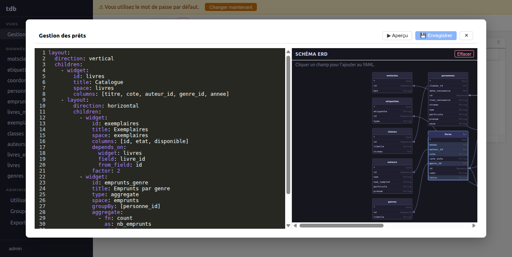

**Utiliser le diagramme ERD pour construire le YAML :**

Chaque boîte représente un espace. Pour chaque champ (rangée) :

- Cliquer sur **`*`** (première rangée, en italique) ajoute l'espace **sans restriction de colonnes**.
  La boîte s'illumine avec le badge `* ✓`.

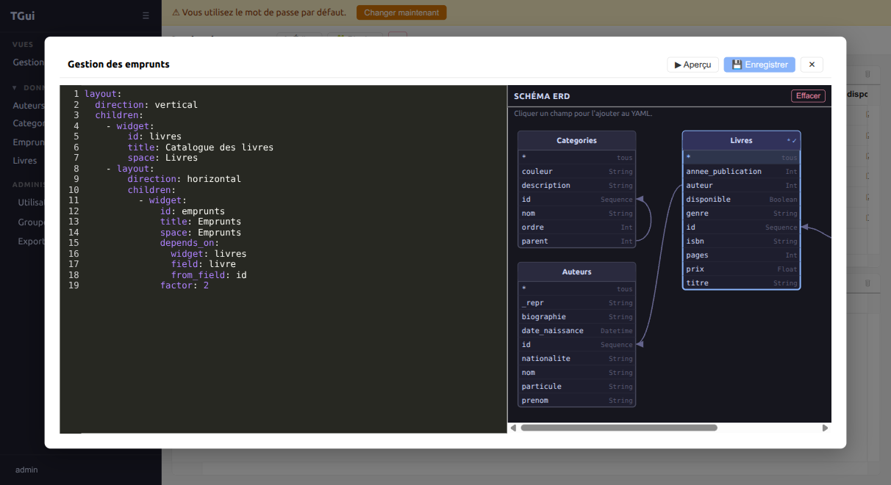

- Cliquer sur un **champ nommé** l'ajoute à la liste `columns` du widget.
  Si l'espace n'est pas encore dans le YAML, il est créé. Si cet espace a une clé étrangère
  vers un espace déjà présent dans le YAML, un `depends_on` est généré automatiquement.

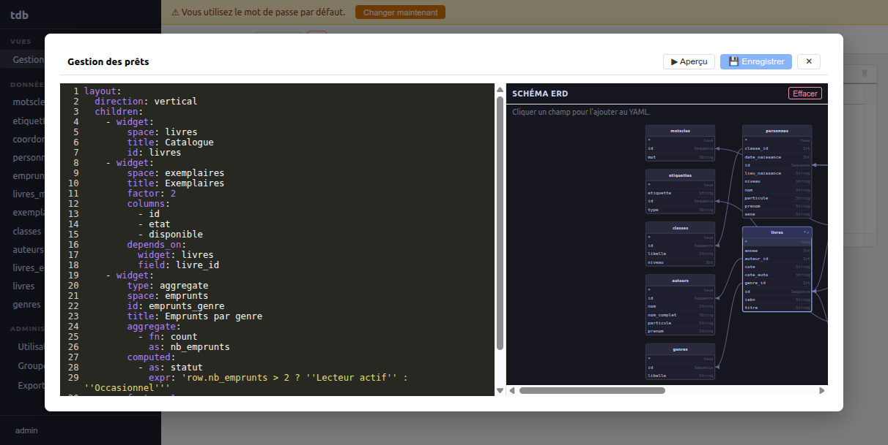

- Recliquer un champ déjà sélectionné le retire. Retirer tous les champs supprime le widget.
- Le bouton **Effacer** réinitialise la sélection.
- Les **flèches** indiquent les clés étrangères ; les **auto-relations** (ex. `parent_id → id`)
  sont dessinées comme une boucle sur le côté droit de la boîte.

**Boutons du modal :**

| Bouton | Action |
|--------|--------|
| **💾 Enregistrer** | Sauvegarde le YAML |
| **▶ Aperçu** | Affiche la vue rendue |
| **✕** | Ferme le modal sans sauvegarder |

### Widgets agrégats

Un widget de type `aggregate` affiche un tableau de synthèse en lecture seule — l'équivalent
d'un `GROUP BY` SQL, calculé en Lua côté serveur.

```yaml
- widget:
    type: aggregate
    title: Par pupitre
    space: chorale
    groupBy: [pupitre]
    aggregate:
      - fn: count
        as: nb
      - field: annee
        fn: avg
        as: annee_moy
```

Les fonctions disponibles sont `sum`, `count`, `avg`, `min`, `max`. L'alias `as` est
optionnel (nom par défaut : `fn_champ`, ex. `avg_annee`).

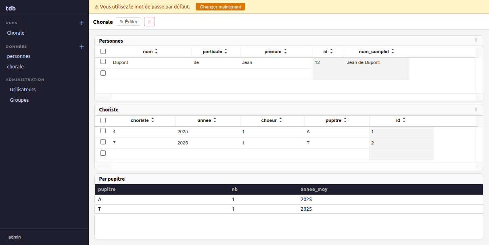

---

## Gestion des utilisateurs et droits (admin)

La section **Administration** n'est visible que pour les membres du groupe `admin`.

### Utilisateurs

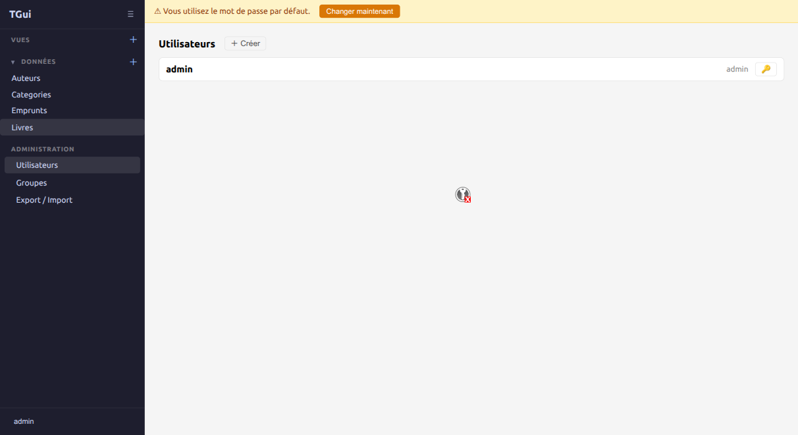

- **+ Créer** : ouvre un formulaire (nom d'utilisateur, email optionnel, mot de passe).
- **[clé]** sur chaque ligne : permet à l'admin de forcer le changement de mot de passe d'un
  utilisateur sans connaître son mot de passe actuel.

### Groupes

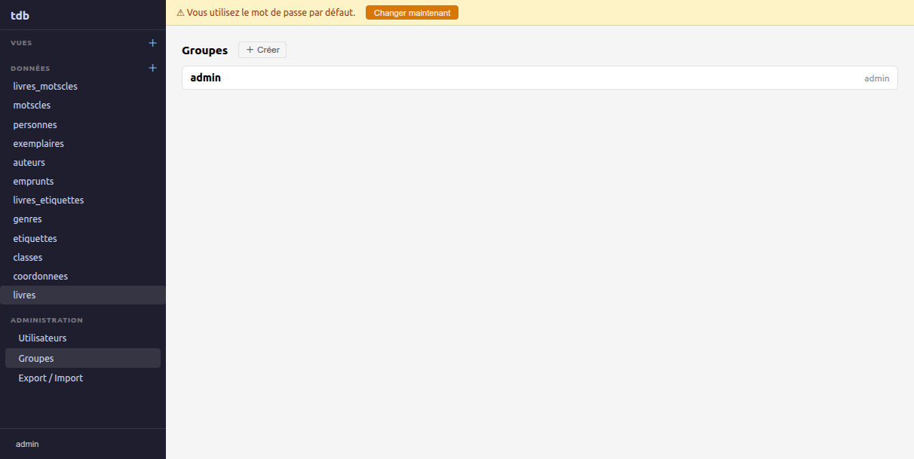

- **+ Créer** : crée un nouveau groupe.
- **[suppr]** : supprime le groupe (hors groupe `admin` qui est protégé).

> Les droits (`grant` / `revoke`) sont actuellement gérables via l'API GraphQL.

---

## Profil utilisateur

Cliquez sur votre **nom d'utilisateur** (en bas à gauche) pour ouvrir le menu :

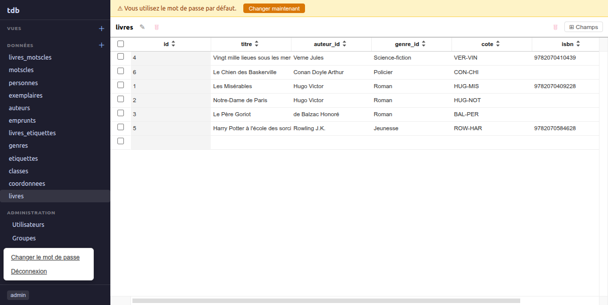

- **Changer le mot de passe** : saisir l'ancien puis le nouveau mot de passe.
- **Déconnexion** : invalide la session côté serveur et revient à l'écran de connexion.

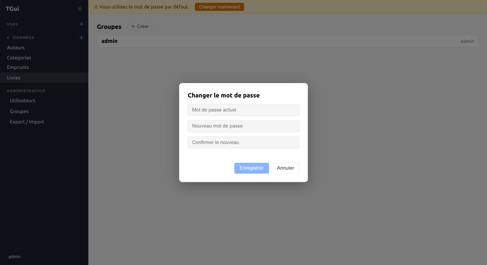

---

## Renommer ou supprimer un espace

Dans la barre d'outils de l'espace :

- **(crayon)** (icône crayon) : renommer l'espace.
- **[suppr]** (icône poubelle à côté du titre) : supprimer l'espace et toutes ses données.

---

## Raccourcis clavier

| Touche | Action |
|--------|--------|
| **Entrée** | Valider la saisie dans une cellule |
| **Échap** | Annuler la saisie en cours |
| **Tab** | Passer à la cellule suivante |
| **Entrée** sur l'écran de connexion | Se connecter |
